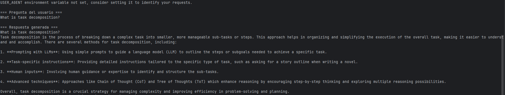

# Proyecto RAG con LangChain

## Descripción

Este proyecto implementa un sistema de Retrieval-Augmented Generation (RAG) utilizando LangChain y OpenAI.
El objetivo es crear un agente capaz de responder preguntas basadas en información real extraída de una fuente de texto (en este caso, un artículo del blog de Lilian Weng sobre agentes autónomos basados en LLMs).

El sistema carga el contenido desde la web, lo divide en fragmentos, crea una base de datos semántica en memoria (vector store) y permite realizar consultas que combinan recuperación de contexto y generación con un modelo de lenguaje.

## Estructura del proyecto

repo2/

│

├── rag_project.py        # Código principal del agente RAG

├── .env                  # Archivo con la clave de API de OpenAI

└── README.md             # Documentación del proyecto

## Requisitos

* Python 3.10 o superior

* Clave de API válida de OpenAI

## Instalación

Clonar este repositorio:

```
git clone https://github.com/tu_usuario/repo2.git
cd repo2
```


## Instalar dependencias:

```
pip install langchain langchain-core langchain-openai langchain-community langchain-text-splitters openai python-dotenv bs4
```

Crear un archivo .env en la raíz del proyecto con el siguiente contenido:

OPENAI_API_KEY=tu_api_key_aqui

## Ejecución

Ejecutar el script principal:

py rag_project.py


Durante la ejecución, el programa:

* Carga el contenido del artículo “LLM Powered Autonomous Agents”.

* Divide el texto en fragmentos manejables.

* Crea una base de datos vectorial en memoria utilizando embeddings de OpenAI.

* Recupera información relevante al recibir una pregunta.

* Genera una respuesta con contexto utilizando el modelo gpt-4o-mini.

Ejemplo de salida
=== Pregunta del usuario ===
What is task decomposition?

=== Respuesta generada ===
Task decomposition is the process of breaking down a complex task into smaller, manageable sub-tasks that can be handled sequentially or in parallel...


### Salida 


